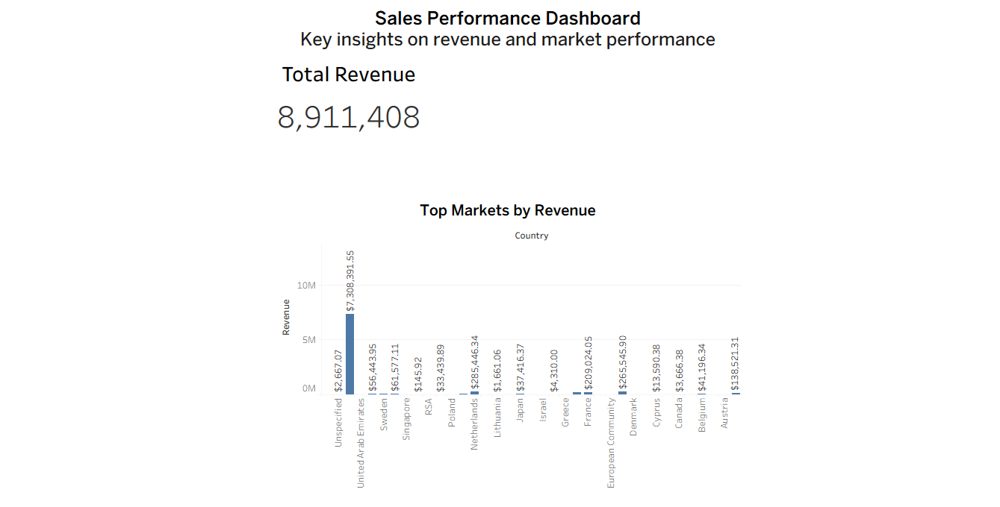

## Customer Sales Analysis Project
## Business Problem

Companies need to understand sales performance, customer behavior, and product demand to make better business decisions.

---

## Objective

Analyze transactional sales data to identify:

- Revenue trends
- Top-selling products
- Customer purchasing behavior
- Sales distribution by country

---

## Data Cleaning

Performed using SQL:

- Removed null CustomerID
- Filtered negative Quantity (returns)
- Removed invalid UnitPrice (≤ 0)

---
## Created a clean dataset:

CREATE TABLE clean_sales AS ...

--- 

## Key Analysis

- Total Revenue
- Top 10 Products by Quantity Sold
- Revenue by Country
- Top Customers by Spending

---

## Key Insights

- The majority of revenue comes from a small group of products
- Certain countries dominate total sales
- High-value customers contribute significantly to total revenue

---

## Tools Used

- SQL (SQLite)
- Visual Studio Code
- Tableau
- Python

---

## Project Structure

- data/ → raw dataset
- analysis/ → data preparation and database creation
- sql/ → analysis queries
---
## Interactive Dashboard

This dashboard provides an overview of revenue distribution across different markets, highlighting key performance differences and growth opportunities.

### Key Insights

- **High revenue concentration:**  
  The United Arab Emirates generates the highest revenue (~7.3M), significantly outperforming other markets. This indicates a strong dependency on a single region.

- **Strong secondary markets:**  
  Countries such as Sweden and Singapore show solid performance, making them ideal candidates for scaling and further investment.

- **Underperforming markets:**  
  Several countries generate relatively low revenue, suggesting opportunities for market expansion and targeted strategies.

- **Data quality issue:**  
  The presence of an "Unspecified" category (~2.6M) indicates missing or incomplete data, which may impact decision-making accuracy.

- **Uneven revenue distribution:**  
  Revenue is not evenly distributed across markets, highlighting the need for a more balanced global strategy.

---

## Business Recommendations

- Reduce dependency on top-performing markets by diversifying revenue streams
- Invest in high-potential regions like Sweden and Singapore to drive growth
- Improve data quality by addressing missing or undefined categories
- Develop localized strategies to boost performance in underperforming markets

## How to Run
- Open the database in VS Code
- Run exploration.sql
- Run cleaning.sql
- Run insights.sql
